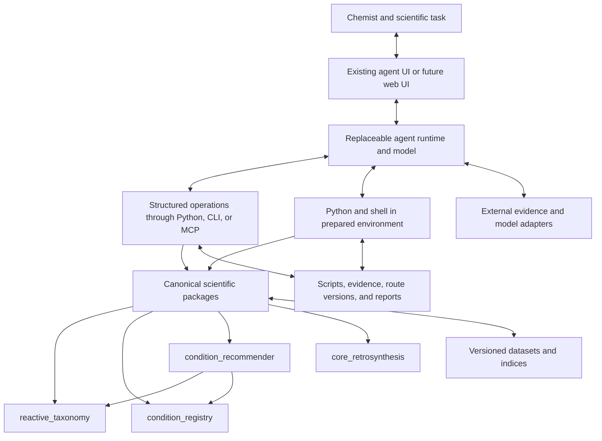

# AI-Native Scientific Tools and Agentic Scientific Workspace

Status: architecture design; development subset implemented, scientific release gates pending

Revision: 2

Date: 2026-09-23

The local workspace and an optional Codex-backed browser conversation interface
now have development implementations. See
[implementation status](Scientific_Workspace_Implementation_Status.md) and the
[quickstart](Scientific_Workspace_Quickstart.md) for the implemented subset and
remaining scientific-validation gates.

## 1. Purpose

Make reaction analysis, datasets, condition recommendation, and retrosynthesis
available as modular scientific capabilities that advanced agents can compose
into an investigation.

The central design is a capable agent working in a prepared scientific
environment: this codebase, its datasets, executable chemistry tools, searchable
documentation, and a writable investigation workspace. The agent can use stable
operations, inspect evidence, write custom analyses, consult external sources,
and revise its strategy. The scientific environment is the main product asset;
the agent runtime and user interface are replaceable clients.

The current Codex session already supplies a useful starting point: an agent
loop, a conversational UI, repository and terminal access, and general tools.
This establishes access and execution capabilities, not demonstrated improvement
in chemistry. The next milestone is a recorded scientific investigation with
this environment, before building a broad MCP catalog or a new agent runtime.

The intended improvement is the ability to choose useful questions, gather
evidence, propose hypotheses, compare alternatives, and revise a plan as new
information arrives. Adding an LLM explanation to a fixed pipeline does not
provide all of these capabilities.

This document develops the intent in [my_idea.md](my_idea.md) and refines the
information-system portion of
[AI_Chemistry_MCP_System_Design.md](AI_Chemistry_MCP_System_Design.md).
It does not replace the package boundaries or release gates in the
[current implementation roadmap](../new/type_agnostic_reaction_recommendation_implementation.md).
Hardware control and autonomous laboratory execution are outside this proposal.

This revision changes implementation priority from interface construction to
workspace preparation and empirical investigation. The aligned
[implementation plan](AI_Native_Scientific_Tools_Implementation_Plan.md) gives
deliverables and acceptance gates.

## 2. Model, agent runtime, and scientific environment

These are separate architectural responsibilities:

| Part | Responsibility |
| --- | --- |
| User interface | Accept structures, questions, and constraints; show progress, alternatives, evidence, and results. |
| Model | Reason about the available context and propose the next action or response. |
| Agent runtime | Manage the investigation loop, context, tool execution, progress, failures, stopping, and continuation. |
| Execution environment | Run Python, shell commands, and jobs against a prepared code and data snapshot, with a writable workspace. |
| Scientific capabilities | Supply domain operations, datasets, evidence, persistent artifacts, and explicit checks. |

The same model can behave differently when provided with a different runtime,
tools, context, and execution budget. An advanced agent can decide what evidence
to acquire and revisit earlier decisions; a fixed sequence of LLM calls exposes
only the reasoning opportunities anticipated by its author.

Here, an agent means a system that can observe intermediate results, choose its
next action, recover from failures, and revise earlier choices toward an
objective. Runtime quality, accessible evidence, feedback, and available actions
can matter even when the model is identical. More autonomy alone does not
establish better scientific reasoning.

Codex is a candidate runtime, not a required dependency of the chemistry
packages. OpenAI describes its harness as managing context, tools, conversation
state, and ongoing execution, and documents integration through its SDK and
app-server. See [Codex as a platform](https://developers.openai.com/blog/codex-as-a-platform).
This supports the integration direction; it does not establish chemistry
performance. Scientific improvement must be evaluated on our own tasks.

The project should invest primarily in the scientific environment. External
agents should be able to use it directly without entering a second internal LLM
controller. A built-in chemistry assistant can remain another client of the
same capabilities.

Do not rank clients by whether their UI looks like chat or a coding application.
OpenAI documents substantial overlap between ChatGPT Work and Codex, with
different experiences for different tasks. Evaluate the actual configured
tools, environment, and outcomes. See
[ChatGPT Work](https://learn.chatgpt.com/docs/get-started-with-work).

## 3. Architecture and ownership

- `reactive_taxonomy` owns molecular and reaction observations, interpretation,
  correspondence, edits, and structural checks.
- `condition_registry` owns substance identities, contextual roles, canonical
  recipes, and its existing protocol-draft contracts.
- `condition_recommender` owns dataset conversion and admission, indexing,
  compatibility, retrieval, ranking, aggregation, and recommendation evidence.
- `core_retrosynthesis` owns its existing domain planning and verification
  operations; the interface should reuse these rather than copy them.
- Application adapters expose capabilities and manage investigation artifacts.
  They do not introduce chemistry rules or an alternative recommendation path.
- External literature and predictive-model adapters remain explicit boundaries;
  deterministic domain libraries remain free of network calls.

Support two complementary access paths:

| Access path | Use | Contract |
| --- | --- | --- |
| Structured scientific operations | Repeatable analysis, retrieval, recommendation, assessment, and routine workflows. | Typed inputs and outputs; canonical chemistry behavior; evidence and versions. |
| Programmable scientific workspace | Questions that need custom comparisons, batch calculations, visualization, or a new sequence of operations. | Recorded scripts, inputs, dependencies, outputs, and assumptions; explicit experimental status. |

Both paths call the same owning packages. A custom script may explore raw data,
but it cannot turn excluded records into eligible recommendations by bypassing
canonical admission or compatibility. Experimental calculations remain available
as separately labeled evidence.

MCP (Model Context Protocol) standardizes how a client discovers and calls tools
and accesses context. It does not provide the model, agent loop, or chemistry
judgment. It is useful for portable and remote access; direct Python and CLI
access are sufficient for the first local pilot. Introduce a thin MCP adapter
when a client needs it, using contracts demonstrated useful in investigations.
Separate services only when operational requirements justify them.

## 4. Meaningful atomic operations

An atomic capability answers one scientific question and returns a result that
can be inspected and reused. It need not correspond to one Python function or
one low-level graph manipulation.

Expose both composable operations and convenient complete workflows. They must
share domain implementations. Do not require an agent to reconstruct routine
normalization or bypass mandatory compatibility checks by manually assembling
low-level calls.

The names below are proposed interface concepts, not claims about current APIs.

| Area | Proposed operations | Result emphasis |
| --- | --- | --- |
| Reaction analysis | `observe_reaction`, `inspect_reaction_center`, `enumerate_interpretations`, `check_transformation` | Structures, atom references, edits, competing interpretations, checks and limitations. |
| Dataset access | `search_precedents`, `get_precedent`, `get_procedure`, `compare_precedents`, `inspect_dataset_coverage` | Complete records, structural query criteria, source provenance, missingness and independent support. |
| Conditions | `resolve_recipe`, `recommend_conditions`, `assess_recipe`, `compare_recipes`, `inspect_component_roles` | Canonical recipes, contextual roles, compatibility, observed variants, and unsupported assumptions. |
| Retrosynthesis | `propose_disconnections`, `generate_precursors`, `evaluate_step`, `find_step_precedents`, `assemble_route`, `revise_route` | Alternative intermediates and steps, structural checks, evidence, dependencies, and unresolved concerns. |
| Evidence access | `get_evidence`, `get_artifact`, `render_structure` | Inspectable source details, stable references, and visual structures tied to machine objects. |

Dataset access should support exploratory searches that do not require a named
reaction family. Exploratory results must retain admission status and must not
silently become trusted recommendation precedents. Known incompatible recipes
may be inspected as counterevidence but remain excluded from eligible rankings.

## 5. An agent-accessible working environment

### Prepared environment

The environment should include a pinned code revision, Python and RDKit
dependencies, versioned definitions, identified dataset and index snapshots,
and a writable directory for each investigation. Begin with the existing local
environment; a reproducible container or remote worker can follow when needed.
Record which capabilities actually run and which require unavailable data,
credentials, models, or services. Repository presence alone is not availability.

Provide a short entry guide listing working invocations, data locations and
coverage, schemas, evidence rules, and known limitations. An agent should be
able to perform a first analysis without rediscovering the public API by reading
large amounts of implementation code.

Useful tools require useful context and feedback. Provide:

- Searchable documentation with preconditions, examples, limitations, and
  distinctions between observations and predictions.
- Typed input and output schemas, stable object references, and explicit units.
- Compact summaries with pagination and access to full records and artifacts.
- A Python API for custom comparisons and batch analysis using the same domain
  operations as the MCP and CLI interfaces.
- Persistent files or records for candidate routes, recipes, evidence,
  hypotheses, and decisions.
- Errors that identify what failed, what partial result remains usable, and
  which inputs or capabilities are missing.
- Execution limits, cancellation, and resumable job references for expensive
  searches or model calls.

### Custom code and scientific authority

An agent may write a derived analysis script when no predefined operation
answers a question. Distinguish three kinds of execution:

| Kind | Example | Treatment |
| --- | --- | --- |
| Existing domain operation | Retrieve eligible precedents or run a registered structural check. | Preserve the authoritative result and its documented validation scope. |
| Derived exploratory analysis | Compare matched substrate subsets, examine procedure differences, or visualize route alternatives. | Save script, input IDs, dependencies, outputs, assumptions, and limitations as an investigation artifact. |
| Change to scientific implementation | Add an operator, compatibility rule, identity definition, or scoring behavior. | Make a separate versioned development change with owning-package tests and applicable review gates. |

Exploratory code can generate new evidence or hypotheses. It does not become a
validated chemistry rule merely because it executes successfully. During a
fixed-baseline evaluation, an agent must not change the definitions or evaluator
against which its proposals are judged. A discovered defect becomes a separate
development issue; a changed baseline requires a separately identified run.

Web research and other tools may supplement the local corpus. Store source
locations, retrieval dates, relevant passages or permitted artifacts, and the
claims they support. External reports and model-generated suggestions retain
their provenance and do not silently enter the trusted index.

The agent's conversation is not the sole scientific record. Domain objects and
evidence must survive context compaction, runtime changes, and resumed sessions.

Start with a lightweight folder containing a run manifest, inputs, scripts,
referenced evidence, results, and a report of decisions and open questions.
Formal investigation storage can grow from these records; it is not a
prerequisite for the first experiment.

### Deployment choices

| Mode | How the scientific environment is reached | Role in this design |
| --- | --- | --- |
| Existing workspace agent, initially Codex | Python, CLI, filesystem, and optionally MCP in the prepared environment. | First development and evaluation client; no new UI or runtime needed. |
| Hosted ChatGPT with remote tools | A supported plugin or MCP integration calls operations on our server. | Reuse a hosted conversational experience; server capabilities must be explicitly exposed. |
| Dedicated scientific website | Browser connects to an application backend that runs or connects an agent runtime and provisions scientific workers. | Later product option with route, recipe, evidence, and artifact views. |

Connecting remote tools to ChatGPT does not replace its built-in code sandbox
with this repository. OpenAI documents managed execution for hosted Work and
remote MCP-backed tools through plugins. To provide custom Python execution in
our environment, we must deliberately supply an execution service or choose a
runtime integration that supports our workers. These are distinct deployment
choices. See [sandboxing](https://learn.chatgpt.com/docs/sandboxing) and
[MCP access](https://learn.chatgpt.com/docs/extend/mcp?surface=cli).

For a website, keep the agent runtime and model credentials on the backend.
Workers use a fixed scientific baseline and separate writable investigation
directories; shared validated datasets can be mounted read-only. Stream progress
and artifact references to the UI, support cancellation, and scope access to
each user's projects. Local and remote clients should use the same scientific
contracts. Scientific packages and saved investigations must not require a
particular model provider, although individual runtime adapters may do so.

## 6. Evidence, hypotheses, and checks

Deterministic code establishes the result of its implemented checks under its
documented assumptions. Passing a graph check does not establish experimental
feasibility, and missing rule coverage does not establish chemical impossibility.

Every assessment should distinguish at least:

| Check outcome | Meaning |
| --- | --- |
| `pass` | A specified check passed within its stated scope. |
| `fail` | A specified check found a violation or contradiction. |
| `unknown` | Evidence is insufficient or ambiguous. |
| `unsupported` | The capability does not implement the required assessment. |
| `error` | The operation failed to execute successfully. |

Preserve existing domain statuses and map them explicitly at the interface;
these categories are not a replacement chemistry schema.

Scientific claims should reference supporting and conflicting evidence and
state assumptions. Record provenance separately from review status: an observed
source report, deterministic inference, model prediction, and agent hypothesis
are different origins, even when a chemist has reviewed them.

Allow agents to propose unfamiliar transformations and condition adaptations in
the investigation workspace. These proposals do not create verified signatures,
override structural contradictions, enter trusted indices, or become observed
experimental records. Promotion requires the existing admission and review
rules. Unknown cases remain available for investigation without being presented
as validated recommendations.

A useful result can say:

> Atom accounting passed. Selectivity is outside the current validator's scope.
> Two source precedents provide partial support, with different substrate
> environments. The proposed step remains a hypothesis.

## 7. Persistent investigation contracts

Reuse existing chemistry and recommendation contracts through references rather
than duplicating their contents in a universal reaction dictionary.

Proposed application-owned objects:

- **Investigation:** objective, user constraints, artifact references, open
  questions, budget, and completion or stopping status.
- **Hypothesis:** a proposed transformation, route choice, component role, or
  condition adaptation, with assumptions, evidence links, and review status.
- **Evidence reference:** source record or artifact ID, relevant fields or
  excerpt location, provenance, versions, and applicable limitations.
- **Assessment:** subject reference, named checks and outcomes, contradictions,
  unassessed properties, and links to authoritative domain results.
- **Decision:** chosen action or alternative, concise rationale, evidence used,
  rejected alternatives, and unresolved questions.

Record tool arguments, result references, schema and definition versions, data
snapshot identity, and model/provider metadata where applicable. Preserve an
inspectable decision record; private model reasoning is not required.

Candidate objects should be immutable or explicitly revisioned. Agent state may
reference a selected version without overwriting the source observation.
Deterministic computations should be replayable from recorded inputs. Replaying
an agent investigation may require recorded model outputs; a fresh model run is
not guaranteed to follow the same path.

## 8. Retrosynthesis as an evolving investigation

The agent should work with a route graph containing competing intermediates,
proposed steps, evidence, constraints, and unresolved questions. Keep its control
of investigation separate from the deterministic operations that evaluate or
expand that graph.

An illustrative workflow is:

1. Analyze a target and propose several strategic decompositions.
2. Ask available engines for precursors under selected structural constraints.
3. Retain an additional agent-proposed candidate as a hypothesis when useful.
4. Check structures, correspondence, and reconstruction where supported.
5. Retrieve step precedents and inspect conditions and procedure details.
6. Investigate downstream selectivity, intermediate stability, or availability.
7. Revise an earlier disconnection or step order when evidence warrants it.
8. Present alternative routes with evidence and explicit unresolved limitations.

Structural consistency, experimental support, selectivity, operating conditions,
and route practicality are separate assessment dimensions. Avoid a single
unqualified `valid_route` flag or a score that implies experimentally established
success.

The expected advantage over fixed search is choosing what to investigate and
when to reconsider strategy. This is a hypothesis to test, not a performance
claim supplied by the architecture.

## 9. Condition reasoning beyond recipe retrieval

The canonical recommender remains responsible for structure-backed retrieval,
hard compatibility, recipe aggregation, and ranking. The agent adds an
investigation around its evidence and limitations.

Useful condition reasoning includes:

- Examining a component's possible roles in this specific reaction context.
- Comparing whole recipes and operating procedures, preserving co-occurrence
  rather than mixing frequent components into an unsupported recipe.
- Identifying substrate differences that may limit transfer from precedents.
- Searching for contradictory examples and reported failure outcomes.
- Proposing an adaptation with explicit assumptions and unresolved questions.
- Identifying observations or experiments that would distinguish hypotheses.

Keep an observed recipe, a normalized representation of that recipe, and a
proposed adaptation distinct. Never invent missing temperature, quantities,
order of addition, concentration, or time. A role may be multiple or uncertain.
Precedent association does not establish mechanism or causality, and an
unreported outcome is not an experimental failure.

An agent's explanation should identify the evidence behind its claims.
Recommendation scores, evidence strength, and calibrated probabilities are
different quantities and must not share an ambiguous `confidence` field.

## 10. Integration with the current codebase

The existing `chem_coworker/assistance/` implementation already contains
capability wrappers, evidence projections, action contracts, policy, and
evaluation support. Reuse useful contracts and domain calls.

Its closed action vocabulary is a starting point for bounded assistance, but
should not define the maximum reasoning space of every external agent. Expose
the underlying scientific operations independently. Add proposed hypotheses
and targeted assessments where they fill a demonstrated scientific gap.

Keep `chem_coworker` a thin application shell. Do not restore `chemtools`, revive
ConditionCore/family routing as a parallel recommender, or move chemistry rules
into prompts. Agent instructions can explain how to use tools and interpret
results; executable scientific behavior stays with its owning package.

## 11. Implementation sequence

Use the same phases as the
[implementation plan](AI_Native_Scientific_Tools_Implementation_Plan.md):

| Phase | Outcome |
| --- | --- |
| 0 | Record baseline and limitations, prepare the workspace and entry guide, separate development and untouched cases. |
| 1 | Run real development investigations using the current agent, existing APIs, and custom scripts; record useful results and obstacles. |
| 2 | Harden the operations demonstrated useful; add thin MCP access where needed and verify parity with direct calls. |
| 3 | Formalize persistent, revisioned investigations and resumable jobs from the pilot artifacts. |
| 4 | Develop and review evidence-backed condition investigations. |
| 5 | Develop and review iterative retrosynthesis with dependency-aware route revisions. |
| 6 | Compare scientific outcomes under controlled conditions and complete untouched evaluation. |
| 7 | Consolidate validated interfaces; deploy remote access or a dedicated website when justified. |

The first pilot should investigate a condition suggestion with an important
substrate mismatch. A second pilot should attempt to revise a multistep route
after identifying a downstream problem. Preserve unsuccessful attempts and
unsupported checks: they identify missing science or tooling rather than
justifying a fabricated successful demonstration. Phases 4 and 5 mature these
capabilities after the early pilots; they can proceed independently.

Promote repeated, useful analysis patterns into public operations only after
their scientific meaning, ownership, and validation requirements are clear.
Do not build a new harness, exhaustive tool catalog, service fleet, or dedicated
UI as a prerequisite for learning from the existing agent environment.

These phases do not waive the roadmap's frozen baseline, blind chemist review,
adjudication, untouched evaluation, corpus validation, or release requirements.
Experimental interfaces must identify the validation status of the artifacts
they expose. Do not tune development against the untouched evaluation set.

## 12. Evaluation and acceptance criteria

Compare the deterministic workflow, the workflow with LLM review, and an
advanced agent using the scientific environment. Within the agent condition,
compare structured-tool-only access against structured tools plus programmable
workspace access. This distinguishes the value of iterative investigation from
the additional value of custom code. Use the same model where possible,
matched budgets, recorded runtime settings, and repeated runs.

For the controlled comparison, hold scientific code, data, and available source
evidence constant. Evaluate open-web research separately, with retrieved sources
recorded and leakage checks against evaluation answers. A system given more
evidence may be more useful, but that alone does not show a better runtime.
Protocol compatibility and a successful tool call likewise do not establish
equivalent agent quality across providers.

Blind chemistry review should assess:

- Step and route plausibility, including dependencies between steps.
- Correctly identified condition-transfer limitations and incompatibilities.
- Whether proposed alternatives address the actual problem.
- Whether cited evidence supports the associated claim, rather than merely
  existing as a valid reference.
- Unsupported assertions, missed contradictions, and appropriate abstention.
- Quality of uncertainty communication and remaining questions.

Operational evaluation should assess successful task completion, tool failures,
recoverability, repeatability of recorded calculations, latency, tokens, and
cost. Test unfamiliar, ambiguous, conflicting, and unsupported cases as well as
straightforward successes.

An integration succeeds when an agent can investigate a problem more effectively
using the exposed capabilities while preserving provenance and domain
boundaries. More tool calls, longer explanations, and successful schema
validation alone are not evidence of better chemistry.
