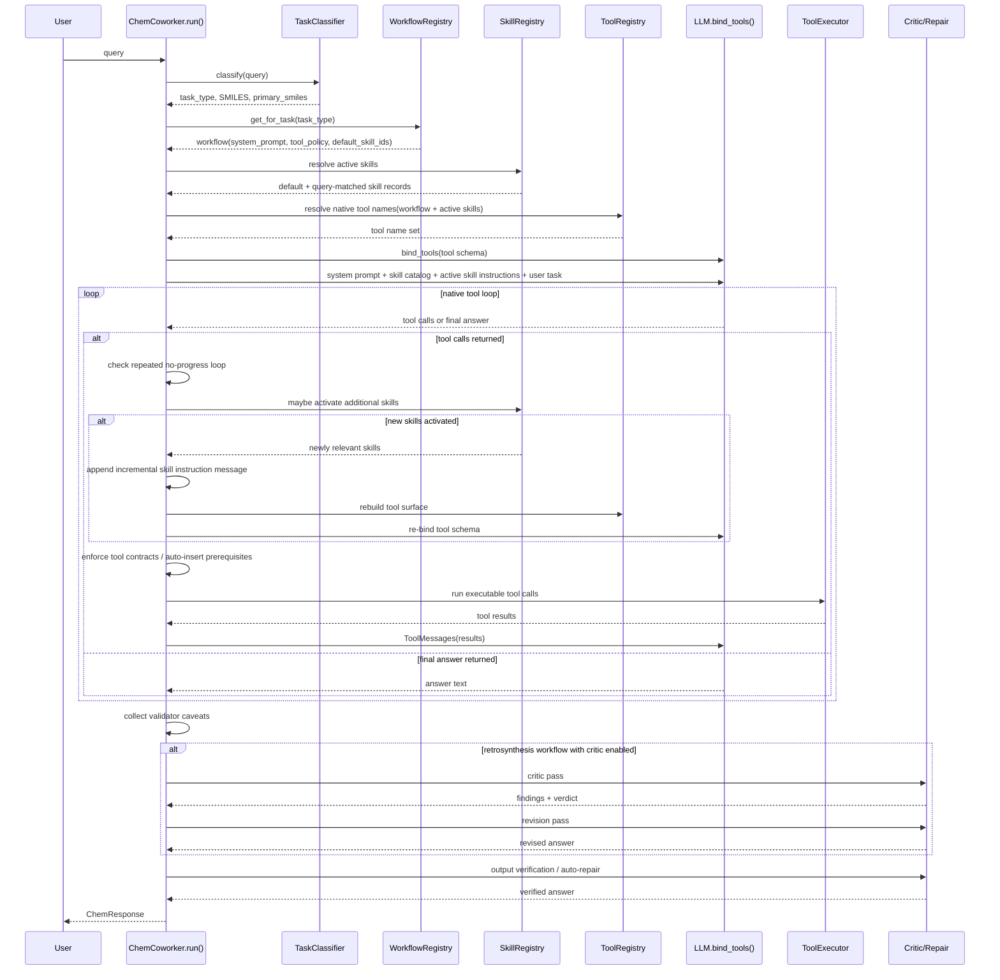

# ChemCoworker Runtime Workflow

## Overview

This document describes the **current implemented runtime flow** of `chem_coworker` after the skills/tool-policy update.

The core execution path is:

1. classify the query
2. route to a workflow
3. activate default and query-matched skills
4. build the tool surface from workflow policy plus active skills
5. run the native tool-calling loop
6. activate more skills mid-loop if new evidence suggests they are relevant
7. validate, critique, repair, and return the final answer

## Sequence Diagram

## Stage-by-Stage Flow

### 1. Agent startup

At initialization, `ChemCoworker` constructs:

- the LLM client
- the tool registry
- the skill registry
- the task classifier
- the tool executor

This happens in `chem_coworker/agent.py` during `ChemCoworker.__init__()`.

## 2. Intake

When `run(query)` is called, the agent first extracts:

- task type
- reaction or molecule SMILES
- primary subject SMILES

This is deterministic and happens before any LLM call.

## 3. Workflow routing

The classified task is routed through `WorkflowRegistry`.

Each workflow now carries:

- `system_prompt`
- `max_iterations`
- `critic_step`
- `llm_visible_tools`
- `default_skill_ids`
- `tool_policy`

Current workflows:

- `retrosynthesis`
- `forward_synthesis`
- `forward_chemistry` as fallback

## 4. Initial skill activation

Before entering the native loop, the agent resolves active skills from two sources:

- workflow defaults
- query-matched skills from the eligible skill registry

Query matching currently uses:

- workflow target
- skill keyword triggers
- basic context requirements such as presence of reaction or molecule SMILES

This means the model starts with a small relevant skill set, not the full skill catalog.

## 5. Tool-surface resolution

The LLM-visible tool surface is then built from:

- workflow tool policy
- workflow explicit tool list
- each active skill's `tool_policy`
- each active skill's explicit `tool_allowlist`

Important behavior:

- normal generic visibility still hides many primitive tools by default
- but an **active workflow or skill policy can intentionally surface those tools**
- this is how skills act like capability profiles rather than just prompt text

## 6. Prompt assembly

The message thread starts with:

1. workflow system prompt
2. compact available-skills catalog for that workflow
3. full instructions for the active skills
4. user task message

This follows the "catalog first, detailed instructions only when active" model.

## 7. Native tool loop

The loop is a normal `bind_tools()` cycle:

1. send current message thread to the model
2. read tool calls or final answer
3. if tools were requested:
   - check contract prerequisites
   - auto-insert prerequisite tools when possible
   - execute allowed tools
   - return `ToolMessage`s
4. repeat until the model writes the answer

## 8. Mid-loop skill hydration

This is the main new behavior.

After each model turn that requests tools, the agent checks whether **additional skills have become relevant** based on:

- model response text
- tools the model is trying to use
- context keys now available from completed tools

If a new skill is activated:

1. an incremental `SystemMessage` is appended with that skill's instructions
2. the tool surface is rebuilt
3. `bind_tools()` is re-created with the updated schema
4. the next loop iteration runs with the expanded capabilities

This makes skills genuinely runtime-reactive instead of only preloaded.

## 9. Loop protection

The agent tracks repeated tool-call signatures and progress markers.

If the model repeats the same tool requests without adding new evidence, the loop stops and moves to answer synthesis instead of spinning.

The progress marker currently tracks:

- completed tools
- provided context keys
- per-call result count

## 10. Post-loop validation

After tool collection finishes, the runtime applies:

- validator caveats from tool outputs
- optional critic pass for retrosynthesis
- optional revision pass after critic findings
- output verification gate
- automatic repair attempt if the answer violates evidence requirements
- confidence aggregation from evidence and warnings

## 11. Final response

The returned `ChemResponse` includes:

- answer text
- tools called
- raw tool results
- structured outputs
- confidence
- warnings
- token accounting
- elapsed time

## Skill Activation Modes

There are now three practical ways a skill becomes active.

### A. Workflow-default activation

Examples:

- `retrosynthesis_route_planning` for retrosynthesis
- `forward_prediction` for forward synthesis
- `reaction_analysis` for general chemistry fallback

### B. Query-triggered activation

Example:

- a query containing "recommend condition" activates `condition_recommendation`

### C. Mid-loop activation

Example:

- the initial path starts with reaction analysis
- the model later mentions literature/notes or reaches context that satisfies another skill
- the runtime activates `literature_curation`
- tool surface expands to literature/note tools for subsequent iterations

## Current Practical Implications

Compared with the earlier version, the coworker is now:

- more policy-driven
- less dependent on one large static system prompt
- more able to expose specialist tools only when justified
- more robust against wasted tool-loop iterations

The chemistry logic still stays in deterministic tools and taxonomy-backed modules. Skills guide **how** to use capabilities, not **what chemistry is true**.

## Implementation Anchors

Main runtime files:

- `chem_coworker/agent.py`
- `chem_coworker/workflow.py`
- `chem_coworker/tools/__init__.py`
- `chem_coworker/skills/registry.py`
- `chem_coworker/skills/catalog.py`

Bundled skills:

- `chem_coworker_skillpacks/bundled/reaction-analysis/SKILL.md`
- `chem_coworker_skillpacks/bundled/condition-recommendation/SKILL.md`
- `chem_coworker_skillpacks/bundled/retrosynthesis-route-planning/SKILL.md`
- `chem_coworker_skillpacks/bundled/forward-prediction/SKILL.md`
- `chem_coworker_skillpacks/bundled/literature-curation/SKILL.md`
