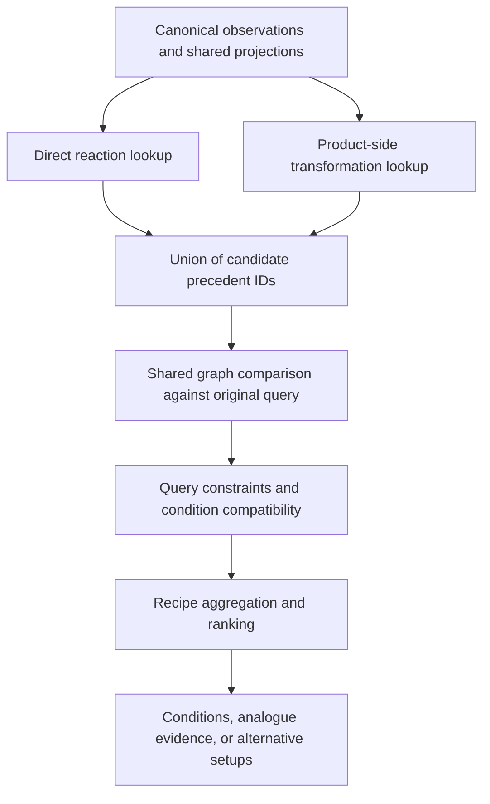

# Shared graph-based reaction retrieval: design proposal

Date: 2026-09-13  
Status: **Target architecture; partial experimental implementation; not a release approval**

Latest implementation: [v2 general edit-graph beta](shared_reaction_core_v2_20260913.md),
including general protected edits, source-qualified aggregation and fresh validation.

Implementation update: an [experimental subset is now executable](shared_reaction_core_implementation_20260913.md).
That report distinguishes the implemented contracts from the remaining
generalization, evaluation and migration work. This proposal describes the
complete target architecture and is not a claim that all phases have shipped.

This proposal develops the foundation discussed for condition recommendation
and single-step retrosynthesis. The primary implementation roadmap remains
[the type-agnostic roadmap](type_agnostic_reaction_recommendation_implementation.md).
Its independent review and untouched-evaluation gates still apply.

## 1. Recommended direction

Build one authoritative observation of a reaction, derive a small hierarchy of
graph projections, and allow two ways to find precedents:

1. search from supplied reactants and products;
2. search from the product-side transformation, reusing the structural matching
   and precedent links that make retrosynthesis useful.

Both channels feed one candidate comparison, compatibility, aggregation and
ranking pipeline. A retrieval hit is a candidate, not evidence that conditions
are transferable. The original molecular observations remain available at every
abstraction level.

The first release should support a deliberately validated set of graph-edit
patterns through the same interfaces, with explicit abstention elsewhere. Do
not grow the Br/I patch into separate reaction-specific fallback functions.
Do not rewrite all molecular featurization or create a second recommendation
engine. Extend the existing reaction observation and core projection contracts.

## 2. Problems the foundation must solve

The current system already has much of the required chemistry machinery:
validated correspondence, edits, reaction events, retained/departing/appearing
remote subgraphs, attachment ports, atom-state transitions and molecular
environment descriptors. The main gap is how these observations are projected,
indexed and compared across related reaction realizations.

Current limitations visible in code:

- Condition signature L0/L1/L2 keys continue to encode source-dependent edits.
  Even the transformation and bond-edit keys include broken bonds and hydrogen
  changes. Moving down the current ladder does not necessarily broaden a source.
- Exact and attachment-relaxed facet keys include the exact bond-edit key, so
  attachment relaxation alone cannot recover every related leaving group or
  fragment source.
- The recently added Br/I path constructs hypothetical lookup reactions. This
  is bounded but does not provide a general reaction representation.
- Retro-generated reactions pass precedent IDs into condition recommendation,
  but the normal direct search does not have a comparable product-side channel.
  A retro result may also use different reactants, making the two queries differ.
- L0 is a detailed condition-signature key but a broad retro operator level.
  Reusing the same label does not establish equivalent abstraction semantics.
- Candidate generation, structural relatedness, experimental evidence quality,
  query flexibility and recipe preference are different concepts. One score or
  one fallback label cannot accurately represent all of them.

Relevant implementation anchors:

- [Signature construction](../../reactive_taxonomy/reaction_signatures.py)
- [Existing reaction core contracts](../../reactive_taxonomy/reaction_models.py)
- [Reaction facets](../../condition_recommender/reaction_facets.py)
- [Retrieval and precedent bridge](../../condition_recommender/generic_retrieval.py)
- [Retro condition integration](../../core_retrosynthesis/condition_ranking.py)

## 3. Three concepts that must stay separate

| Concept | Question answered | Example |
| --- | --- | --- |
| Abstraction level | How much graph detail agrees? | Same local transfer core, different source attachment |
| Evidence quality | How well is that relationship supported? | Validated mapping, reconstructed correspondence, or ambiguous origin |
| Query flexibility | What is the user willing to change? | Fixed Ar-I starting material; alternative CN sources allowed |

An L2 hit can have excellent source provenance but weak transfer relevance. An
L0 hit can have ambiguous mapping. Neither case should be described by a single
confidence number. Scores must not imply probabilities unless independently
calibrated for a stated outcome.

## 4. One observation, several derived views

### 4.1 Preserve the exact observation

Continue to store the parsed component graphs, atom-reference provenance,
validated correspondence or explicit alternatives, formed/broken/order-changed
bonds, hydrogen and charge changes, stereochemical changes, event relationships,
and original conditions and citations.

Atom map numbers and component indices remain provenance, not canonical identity
tokens. Canonical core identity must be invariant to atom renumbering, component
ordering and equivalent aromatic/Kekule serialization, while retaining relevant
stereochemical distinctions.

Do not force named reaction families. Do not resolve symmetry or conflicting
mapping by arbitrary atom selection. Produce multiple qualified projections or
an unavailable status when uniqueness is not supported.

### 4.2 Extend the existing core projection

Start from observed edit endpoints and their before/after atom states. Preserve
the event graph, intramolecular/intermolecular topology and connections between
events. Include the complete functional units required to identify the
transformation: for example, a nitrile carbon must retain its bonded nitrogen
and triple bond, rather than becoming an undifferentiated carbon endpoint.

Represent attachments to this retained core through graph-bound ports. Each
port refers back to the original atom/bond evidence and carries its actual
fragment graph, continuity status and environment. No base schema requires
electrophile/nucleophile roles.

Classify information for projection as:

- **protected transformation information:** features that define what happened;
- **realization context:** qualified attachment/source differences that can be
  considered in analogue retrieval;
- **remote environment:** surrounding structure that can be compared at
  progressively coarser resolution;
- **unresolved:** information whose role cannot safely be assigned.

This classification needs executable graph validation and versioned chemical
definitions. It must not be inferred from a reaction name or a reagent column.
Unresolved edits remain protected by default. No rule may simply discard all
broken bonds, hydrogen changes, or atoms absent from the reported product.

Functional-unit closure and port-generalization definitions should be small,
reviewable and graph-based. Use the centralized SMARTS cache where patterns are
appropriate. JSON may select registered behavior but must not dynamically import
arbitrary executable code.

### 4.3 Proposed L0/L1/L2 contract

Use explicit machine names and a new versioned namespace. L0/L1/L2 are display
labels for this new contract, not aliases for existing RS3 or retro keys.

| Proposed level | Machine meaning | Preserved | Generalized |
| --- | --- | --- | --- |
| L0 | `observed_local` | Observed local edits, atom states, functional units, source/departing attachments, detailed local environment | Only remote structure outside the specified core |
| L1 | `retained_local` | Protected transformation graph, functional units, event topology and local chemical environment | Qualified realization ports such as departing/source attachments |
| L2 | `retained_typed` | Protected transformation graph and essential reacting-center classes | Additional environment detail through a validated class hierarchy |

Whole-reaction identity is checked separately before L0. A displayed exact
local core is not an identical molecule or reaction.

All levels are deterministic projections of the same observation. A coarser
projection records exactly which features it generalized and links back to the
original values. A record with an eligible L0 projection may still have no
eligible L1/L2 projection if generalization is ambiguous.

Proposed projection metadata:

```text
projection_family, projection_schema_version, definition_manifest_hash
observation_id, correspondence_hypothesis_id
level_name, canonical_graph_key, graph_payload
protected_edit_references, port_references, generalized_feature_references
product_side_key, evidence_status, warnings, eligibility_reasons
```

Reaction signature IDs, operator IDs and source observation IDs remain distinct
identities linked by provenance. This avoids pretending an executable operator,
an observed reaction and a similarity projection are the same object.

### 4.4 The cyanation example

For an Ar-I reaction forming Ar-CN, preserve the newly formed bond between the
aromatic carbon and nitrile carbon, the C#N unit, reacting-position environment,
and the full observed edits of the supplied source.

L1 may qualify another realization that differs in departing fragment or CN
source. L2 may qualify a different surrounding aromatic environment. Each
difference remains available to compatibility and explanation.

`C#N` in reaction SMILES is a literal molecular input, not an unspecified CN
source. A source-unspecified transfer query must be represented explicitly.
If the source occurs only among conditions, use structure-backed fragment-origin
evidence and the registry's qualified source capability. Do not manufacture an
observed atom map or silently add a guessed reactant.

Important counterexamples:

- A different C-C coupling must not match just because it forms C-C; the nitrile
  unit is protected.
- Nitrile reduction must not match nitrile installation.
- Direct aromatic C-H functionalization must not become an equivalent Ar-X
  substitution merely by dropping its hydrogen-change evidence.
- Two aromatic C-O cleavages must retain the different departing fragment graphs.
- A different product-forming step that reaches the same product is an
  alternative synthesis, not automatically condition evidence for this step.
- Multi-event reactions cannot match after silently removing inconvenient edits.

## 5. One comparison contract

Candidate generators return observation IDs and how they found them. One
comparison function qualifies every candidate against the same original query:

```text
compare_reactions(query, precedent, projection_policy, allowed_variations)
  -> match_level
     transformation_alignment and evidence references
     differences in ports, source, local environment and remote scaffold
     protected-edit conflicts and unresolved comparisons
     relation: same_setup | analogue_evidence | alternative_setup | incompatible
     eligibility and explanation
```

The query's atom-aligned transformation determines the match, not the generator
name, template rank or shared product. Candidate retrieval may be permissive;
promotion to condition evidence must be explicit and auditable.

Substrate, source and leaving-group differences are separate dimensions. Do not
impose a universal scalar rule that changing a source is always less important
than changing a ring. Versioned rules decide which differences are forbidden,
review-qualified or eligible for ranking. Exact original fields remain available
for those decisions.

## 6. Direct and product-side retrieval



Direct lookup progresses through whole-reaction identity, L0, L1 and L2.
Product-side lookup is an additional candidate channel, invoked when compatible
support is insufficient or the user explicitly explores alternatives. It is not
another confidence level and does not bypass the ladder.

Reuse the product graph matching and precedent provenance useful in
retrosynthesis. Restrict matching to the requested transformation's product-side
site when that site is known. For symmetric products, retain equivalent site
alignments and qualify them; do not select one arbitrarily.

Condition search does not need route search, stock ranking or recursive calls
back into condition recommendation. An application service may initially compose
the existing product-side matcher and the condition engine through a typed
candidate-provider interface. Shared chemistry remains in `reactive_taxonomy`.
The condition package must not acquire a dependency on the retro planner.

The existing `preferred_reaction_ids` bridge should become a normal source of
seed candidates under this comparison contract. Being cited by an operator
does not establish higher priority than a stronger direct precedent. Union and
deduplicate candidates, then compare and rank together. The same precedent
found through both channels counts once for evidence support.

Keep all eligible query-consistent interpretations when mapping is ambiguous.
Do not choose the interpretation that happens to retrieve the most recipes.

## 7. Conditions and alternative reaction setups

Query semantics should distinguish an observed reaction, an explicitly flexible
transformation intent, and product-only synthesis exploration. Product-only
exploration cannot be represented as a fully specified condition query.

Supplied starting materials remain fixed unless the query explicitly permits
alternatives. Analogue evidence can still be shown for a fixed query, but a
proposal using Ar-Br must not silently replace the user's Ar-I starting material.
Similarly, changing a CN source changes the proposed reaction setup and must be
shown alongside the recipe.

Resolve condition identities, contextual roles and source capabilities through
`condition_registry`. Keep actual reactant inputs linked to the selected
precedent realization. Aggregate by the canonical resolved recipe and its
applicable input/source context. Do not merge two options that require different
sources into a deceptively identical recipe, or assemble a hybrid recipe from
ingredients of unrelated precedents.

The broadening decision uses compatible independent evidence units, rather than
raw observation counts. Count repeated references once according to the existing
support policy. The display limit is not an instruction to search indefinitely
until enough distinct recipes appear. Report a supported shorter shortlist or
an explicit limited-support result when appropriate.

Hard chemistry and explicit user constraints run before similarity. Missing
compatibility evidence remains unknown, not proof of compatibility. Historical
yields describe cited precedents; they do not predict the new reaction's yield.

## 8. Keep the user interface small

Retain a primary search scope and the three preference choices already discussed:
Balanced, Closest chemistry and Strongest supporting evidence. Detailed weights
belong in an advanced view and cannot override graph or compatibility gates.

The result should emphasize:

- the selected conditions and actual source/input requirements;
- Whole reaction / L0 / L1 / L2 match label with its definition;
- what agrees and what differs;
- independent supporting references and uncertainty;
- whether this is condition evidence for the supplied setup or an alternative.

Example explanation:

> Same nitrile-installation core. The cited precedent uses a different departing
> group and CN source. Retrieved through product-side matching and qualified as
> analogue evidence for the supplied reaction. Inspect the source and substrate
> differences before treating the reported recipe as transferable.

Do not expose several conflicting L-number systems. Show detailed internal
template levels only in diagnostics, with their namespace and version. Evidence
quality, search channel and abstraction level should have separate fields.

## 9. Dataset building and artifact lifecycle

Build from the canonical source observations rather than independently
re-featurizing the same reaction inside each subsystem:

1. Normalize component/source identities and preserve raw source records.
2. Establish and validate correspondence; persist ambiguity and provenance.
3. Build exact observations and qualify each projection level independently.
4. Resolve conditions, stages and source capabilities independently of chemistry.
5. Derive direct lookup keys and product-side lookup features from the same
   projection contract. Compile executable operators only where their stronger
   reconstruction/admission requirements are satisfied.
6. Build direct, product-side and reference/recipe indices linked by stable IDs.
7. Validate manifests and cross-artifact integrity, then publish one consistent
   artifact set atomically.

Do not precompute every hypothetical leaving-group/source/scaffold combination.
Store a bounded number of projections of each actual observation. Derive
product-side retrieval features from those projections; operator compilation
remains a qualified consumer of the observation, not a substitute for it.

Manifests should contain source and observation hashes, schema/definition and
algorithm versions, admission policies, counts by evidence and projection level,
lookup completeness, unavailable-projection reasons, and the IDs linking
operator precedents to condition records. Full and Compact should differ in
selected observations, not in chemistry definitions or projection semantics.

An operator may be structurally usable while its source record has no resolved
conditions. Report that fact. Product-side retrieval must not make missing
recipes appear available. Runtime refuses incompatible artifact combinations
with an actionable explanation rather than silently changing semantics.

Existing stored observations and reaction cores should be audited for backfill
coverage. Recompute derived projections from sufficient stored graphs/edits;
re-featurize only records whose necessary evidence is absent or whose upstream
chemistry contract genuinely changed. Preserve old artifacts until the new set
passes validation. Do not start an expensive full conversion before the core
contract and blind validation panel are stable.

## 10. Implementation sequence and exit gates

| Phase | Deliverable | Exit condition |
| --- | --- | --- |
| A. Freeze and specify | Baseline artifact hashes; query semantics; comparison/level specification; read-only discrepancy audit | Direct-versus-retro misses classified as retrieval, structural mismatch, source mismatch, admission, library mismatch, or budget |
| B. Core contract | Typed projections and comparison implemented in the owning packages | Deterministic/invariant graphs; protected information preserved; unsupported cases explicitly unavailable |
| C. Small shared dataset | Direct and product-side indices from one controlled observation set | No dangling source IDs; correct level eligibility; identical qualification regardless of retrieval channel |
| D. Canonical retrieval | Union of candidates, one comparison and recipe path; simplified explanations | No privileged seed bypass, double counting, or silent input substitutions |
| E. Independent validation | Blind chemist review, disagreement resolution, then untouched evaluation | Predeclared safety/quality criteria met without tuning on the untouched set |
| F. Migration and consolidation | Audited Full/Compact backfill, validated atomic artifact publication, application cutover | New artifacts consistent; obsolete narrow/duplicate routes removed; full suite and API/browser checks pass |

Phases A-D are experimental development behind an explicit configuration. Phases
E-F follow the primary roadmap's review, evaluation and full-corpus release
order. A passing unit suite alone is not permission to describe transfer quality
as validated or statistically calibrated.

### Required validation matrix

Include graph families beyond the motivating example: C-C coupling, C-N/C-O/C-S
formation, acyl substitution, bond-order changes, ring closure/opening,
stereochemical changes and multi-event reactions. A case need not support all
levels; correct abstention is a valid outcome.

For each supported generalization, include positives, close negatives,
ambiguous evidence and contradictory evidence. Include the Ar-I cyanation query
with multiple observed departing groups, multiple graph-supported source
contexts, and different aromatic environments. Include real held-out source
records in addition to synthetic unit fixtures.

Required regressions and reports:

- atom/component ordering and aromatic-serialization invariance;
- local functional-unit preservation and source/port alignment;
- no-op and unrelated product-side transformations rejected;
- topology, hydrogen, charge and stereo contradictions retained;
- source-unspecified intent never confused with literal HCN input;
- same evidence reached through direct and product-side channels receives the
  same relation, eligibility, level and compatibility outcome;
- returned retro precedents missing from condition results have explicit reasons;
- no evidence inflation from duplicate records or multiple retrieval channels;
- canonical recipe variants and alternative input/source requirements preserved;
- retrieval recall on judged eligible precedents, analogue relevance, false
  transfer rate, abstention, independent support and explanation completeness;
- outcomes by transformation, abstraction level, evidence quality and dataset;
- cold/warm latency, memory and candidate counts on representative Full queries;
- leakage prevention across both operator and condition artifacts using shared
  reference/canonical-reaction partitions, with fixed budgets across comparisons.

Freeze acceptance thresholds and dataset partitions before untouched evaluation.
Compare direct-only, product-side-only and combined retrieval using the same
qualification rules. Do not treat held-out recipe recovery as experimental proof
of condition transfer.

## 11. Consolidation and explicit non-goals

After validated parity and migration, remove the Br/I hypothetical-query path
and consolidate signature/facet/core fallbacks behind the new comparison and
retrieval contract. Keep authoritative exact observations and useful molecular
descriptors. Preserve historical artifacts for audit, not as parallel public
runtime paths. Temporary readers/mappers require a stated removal gate and
regression tests.

Retrosynthesis continues to own executable reverse application, precursor
proposal and planning. The registry continues to own substance/recipe identity.
Shared graph observation, projection and alignment belong to taxonomy; precedent
admission, indices, compatibility and ranking belong to recommendation. Apps only
compose these capabilities.

Do not add a new public package for every view. Do not introduce a reaction-name
router, arbitrary embedding replacement, universal leaving-group reactivity
score, predictive yield claim or automatically generated experimental recipe.

The first milestone is the graph contract, discrepancy audit and a small shared
validation dataset. Full-corpus migration follows the validation gates above.
